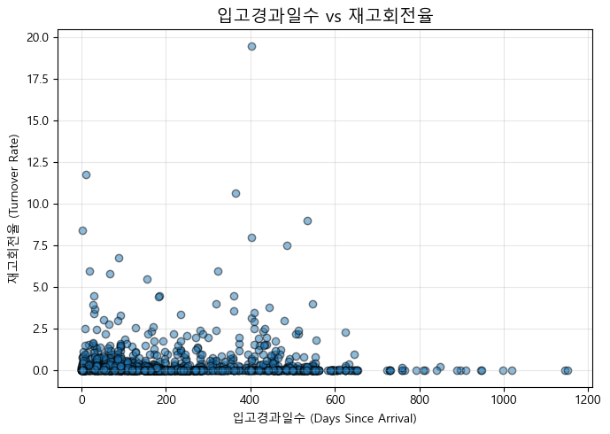

## 🧾 부진 재고 분류 및 로직 개발

### 📘 프로젝트 개요  
기업의 재고 데이터를 기반으로 판매 대비 재고 수준을 분석하고, 재고 회전율·판매속도 등을 활용해 부진 재고를 자동 분류하는 로직을 개발한 프로젝트.  
데이터 기반으로 재고 효율성을 개선하고, 과잉 재고로 인한 비용 손실을 줄이는 것 목표.

---

### 🎯 프로젝트 목표  
1. 부진 재고 자동 분류 로직 개발  
   - 판매량, 재고수량, 재고회전율 기준으로 3단계 분류  

2. 재고 효율성 지표 설계  
   - 최근 3개월 기준 재고회전율, 판매속도 산출  

3. 분석 결과 시각화 및 리포트화  
   - 분류 결과 및 주요 인사이트 시각화  

4. 향후 개선 제안 도출  
   - 자동화·대시보드화 등 확장 방향 제시
---

### 📂 데이터 개요  

본 프로젝트에서 사용된 데이터는 재고 관리 파일(Excel)로, 최근 3개월간의 판매 실적 및 현재 재고 현황을 포함.  

| 구분 | 내용 |
|------|------|
| **데이터 출처** | 대연 과제 제공 내부 데이터 |
| **데이터 형태** | Excel (`.xlsx`) |
| **분석 단위** | 상품(SKU)별 |
| **관측 기간** | 최근 3개월 |
| **주요 컬럼** | `상품코드`, `상품명`, `분류`, `최근3개월판매수량`, `현재재고수량`, `단가`, `입고일자`, `마지막판매일` |
| **용도** | 재고 회전율 산출, 판매패턴 분석, 부진 재고 분류 로직 개발 |

> 📌 데이터는 익명 처리된 내부 자료로, 외부 공개용으로 일부 항목은 가공되어 있습니다.

---

### 🧮 분석 과정  

1️⃣ **데이터 전처리**  
- Excel 파일 불러오기 및 결측치 처리  
- 자료형 변환, 불필요 컬럼 제거  
- 판매량·재고량 이상치 제거 및 단가 검증  

2️⃣ **핵심 지표 산출**  
- 최근 3개월간 **재고회전율(판매량 ÷ 평균 재고)** 계산  
- 판매 간격 기반 **판매속도(Stock Velocity)** 산출  
- 재고 수준과 판매 패턴의 상관관계 분석  

3️⃣ **재고 분류 로직 개발**  
- 지표 기준으로 **‘부진 재고’, ‘관심 재고’, ‘정상 재고’** 세 그룹 분류  
- 조건 기반 분류 함수(`classify_inventory()`) 작성 및 적용  
- 로직 검증 및 샘플 케이스 테스트  

4️⃣ **시각화 및 결과 검증**  
- 분류별 품목 수 막대그래프 시각화  
- 재고회전율 분포 및 상관 히트맵 분석  
- 카테고리별 재고 구조 비교  

5️⃣ **인사이트 도출 및 제안**  
- 부진 재고 집중 영역 식별  
- 가격대·입고시기·판매빈도 간 관계 분석  
- 향후 재고 관리 효율화 및 자동화 제안 도출

---

### 📊 주요 결과   


1️⃣ **재고 분류 결과 요약**  
- 전체 재고 1,975개 중  
  - **부진 재고:** 약 25%  
  - **관심 재고:** 약 50%  
  - **정상 재고:** 약 25%  
- 부진재고점수 평균은 약 0.6 수준이며, 대부분 0.5~0.7 구간에 분포  
→ 판매가 활발하지 않거나 회전율이 낮은 제품이 전체의 절반 이상 차지  


2️⃣ **사업군(biz)별 부진 비중**  
| 구분 | 부진재고 비율 |
|------|----------------|
| 의류(AP) | 25.96% |
| 신발(FW) | 24.12% |

- 의류(AP)군이 신발(FW)군보다 약 1.8%p 높은 부진 비율  
- 의류는 시즌성과 스타일 변화 주기가 빨라 재고 효율이 상대적으로 낮음  

3️⃣ **성별(gender)별 부진 비중**  
| 구분 | 부진재고 비율 |
|------|----------------|
| KIDS | 28.47% |
| WOMENS | 26.29% |
| MENS | 23.48% |

- 유아(KIDS) 및 여성(WOMENS) 제품군이 남성(MENS) 대비 재고 효율이 낮음  
- KIDS는 사이즈·시즌성 영향, WOMENS는 스타일 주기 단축이 주요 원인  

4️⃣ **제품 형태(silhouette)별 부진 비중**  
| 제품 형태 | 부진재고 비율 |
|------------|----------------|
| HOODED LONG SLEEVE TOP | 60.19% |
| PANTS | 38.74% |
| HIGH TOP | 35.29% |
| LONG SLEEVE TOP | 33.33% |

- 후드형 긴팔, 팬츠, 하이탑 등에서 높은 부진 비율 확인  
- 해당 품목은 회전율·소진율 모두 낮아 장기재고화 위험 높음

5️⃣ **부진 재고 집중 영역 요약**  
- **사업군:** 의류(AP)  
- **성별:** KIDS, WOMENS  
- **제품형태:** HOODED LONG SLEEVE TOP, PANTS  
→ 시즌성·사이즈 변화·패션 주기 영향이 큰 군에서 부진 집중  

6️⃣ **종합 인사이트**  
- 전체 재고 중 약 70~80%는 정상적이지 않은 흐름(부진 또는 주의 필요)에 속함  
- 재고 효율이 낮고, 회전율 중심의 **재고 리밸런싱 전략 필요**  
- **판매 촉진·할인·상품 노출 개선 등 관리 강화 필요**

---

### 💡 개선 및 제안  



- 판매 속도와 시간 경과의 관계를 시각화한 그래프.  
- 오래된 재고일수록 회전율이 낮아 부진 가능성이 높음을 보여줌.  

1️⃣ **재고 구조 리밸런싱 필요**  
- 전체 재고의 약 70~80%가 정상적이지 않은 흐름(부진 또는 주의 필요)에 속함  
- 회전율이 낮은 품목 중심으로 **재고 감축 및 재배치 전략** 수립 필요  
- 부진 재고가 특정 제품군(AP, KIDS, WOMENS)에 집중되어 있으므로, 해당 군의 생산·입고 계획을 우선적으로 조정해야 함  

2️⃣ **판매 촉진 및 가격 전략 강화**  
- 관심 재고(전체의 약 50%)는 부진으로 전환될 위험 구간  
- 이 구간에 대해 **할인·프로모션·상품 노출 강화** 등 단기 판매 촉진 필요  
- 특히 후드형 긴팔·팬츠류 등 시즌성 제품은 **기간 내 소진을 목표로 하는 단기 판촉 전략**이 유효  

3️⃣ **데이터 기반 재고 관리 체계 구축**  
- 재고 회전율, 소진율, 입고경과일수를 정기적으로 계산하는 **자동 스코어링 시스템** 도입 권장  
- 월 단위로 재고 점검 및 점수 기반 상태 분류를 자동화하여, **실시간 재고 리스크 모니터링 체계** 구축 가능  

4️⃣ **제품군별 관리 지표 세분화**  
- 시즌성·성별·형태별 특성이 다른 만큼, 제품군 단위로 별도의 **기준 회전율·소진율 임계값(threshold)** 설정 필요  
- 예: WOMENS·KIDS 군은 0.5 이하를 부진 기준으로 설정하는 등 맞춤 관리  

5️⃣ **향후 확장 방향**  
- 스코어링 결과를 Tableau·Power BI 등으로 시각화하여 관리자가 **부진 재고 비중과 추세를 대시보드로 실시간 확인**할 수 있도록 개선  
- 판매·입고·재고 데이터의 **월별 누적 추이 분석 모델**로 확장 가능

---

### 🧰 사용 기술 스택  

| 구분 | 사용 도구 및 기술 | 주요 활용 내용 |
|------|------------------|----------------|
| **언어** | Python (3.9) | 데이터 처리, 지표 계산, 시각화 전 과정 수행 |
| **분석 환경** | Jupyter Notebook | 분석 및 시각화 코드 실행 환경 |
| **데이터 처리** | pandas, numpy | 데이터 불러오기, 결측치 확인, 파생 변수 계산, 정규화 처리 |
| **시각화** | matplotlib, seaborn | 분포, 회전율, 소진율 등 지표 시각화 및 인사이트 도출 |
| **버전 관리** | Git, GitHub | 코드 및 보고서 관리, 포트폴리오 업로드 용도 |
| **문서 작성** | Microsoft Word | 분석 결과 정리 및 보고서 작성 (최종 제출 문서) |

---

### 📁 폴더 구조  
```
daeyeon_project/
│
├─ data/ # 원본 및 전처리 데이터
│ ├─ original_data.xlsx # 2025년 6월 기준 판매·재고 원본 데이터
│
├─ notebooks/ # 분석 코드
│ └─ Analysis of sluggish inventory data.ipynb # 전체 분석 및 시각화 수행 노트북
│
├─ report/ # 최종 보고서
│ └─ 부진 재고 분류 및 로직 개발 보고서
│
├─ images/ # 시각화 결과 이미지
│ ├─ 그룹별 부진 재고 비율.png
│ ├─ 입고경과일수_재고회전율.png
│ ├─ 재고회전율 분포.png
│ └─ 재고 분류.png
│
└─ README.md # 프로젝트 개요 및 문서 설명
```
---
